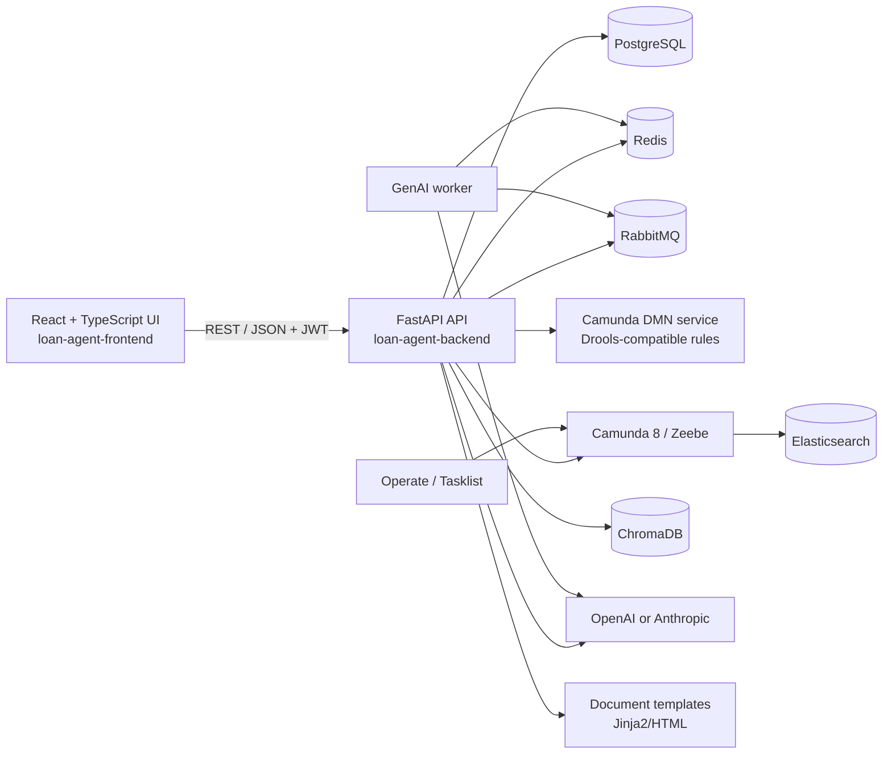

# Loan Process Agent

An AI-assisted loan collection platform that combines a FastAPI application, a TypeScript web UI, rules and decision services, workflow orchestration, retrieval-augmented generation (RAG), and asynchronous workers.

The repository is organized as a single deployable workspace so the API, UI, BPMN/DMN definitions, supporting services, and local development stack can be versioned together.

## What the system does

- Manages customers, loan cases, assignments, contacts, tasks, and workflow instances.
- Applies deterministic collection, risk, priority, and compliance rules.
- Runs BPMN-style collection workflows and integrates with Camunda 8 / Zeebe for process execution and monitoring.
- Generates case summaries, collection scripts, intent analysis, willingness-to-pay scores, and compliance checks with OpenAI or Anthropic.
- Grounds model responses on Hong Kong lending and privacy material stored in the RAG knowledge base.
- Produces collection letters, payment plans, demand letters, settlement offers, receipts, and cease-and-desist acknowledgements.
- Exposes dashboards, workflow/DMN editors, analytics, and GenAI tools through the frontend.

## Architecture



### Runtime boundaries

| Boundary | Responsibility | Main implementation |
| --- | --- | --- |
| Presentation | Login, case management, dashboards, rules and workflow designers | `loan-agent-frontend/` (React, TypeScript, Vite, Tailwind, Zustand) |
| API and domain | Authentication, cases, workflows, rules, analytics, GenAI, documents, deployment endpoints | `loan-agent-backend/app/` (FastAPI, SQLAlchemy, Pydantic) |
| Persistence | Transactional entities, migrations, audit-oriented records | PostgreSQL + Alembic |
| Caching and async work | Short-lived results, job state, and GenAI task delivery | Redis + RabbitMQ + `workers/genai_worker.py` |
| Decisioning | Priority, risk, contact strategy, and compliance decisions | Python rule catalog plus Camunda DMN service |
| Process orchestration | Long-running collection processes, user tasks, escalations, monitoring | Camunda 8 / Zeebe, BPMN and DMN under `camunda-service/` and `camunda-deployments/` |
| Knowledge retrieval | Regulatory and policy context for grounded AI responses | ChromaDB + `rag/knowledge_base/` |
| Document output | HTML-based customer communications and payment artifacts | `app/templates/documents/` and `services/documents/` |

## Data flow

1. A user signs in through the frontend. The backend validates credentials and returns a JWT used by subsequent API calls.
2. A case is created or retrieved from PostgreSQL. Case, customer, loan, contact, and workflow records are validated with Pydantic and persisted with SQLAlchemy.
3. The API evaluates deterministic rules for priority, risk, contact eligibility, and recommended strategy. Where configured, the rule request is delegated to the Camunda DMN service.
4. The API starts or advances a workflow. Short-lived local workflow definitions are handled by the Python workflow engine; deployed BPMN processes are sent to Zeebe. User tasks and process state are observable through Operate and Tasklist.
5. GenAI requests are either handled synchronously or published to RabbitMQ. The worker invokes the configured provider, writes status/results to Redis, and returns the result through the API.
6. RAG-enabled requests retrieve relevant regulatory or policy passages from ChromaDB before the model call. Provider credentials are read only from environment variables.
7. Document endpoints render Jinja2 templates using case and payment-plan data, returning generated HTML/attachments for downstream delivery.
8. Analytics endpoints aggregate operational data for the dashboard; workflow and rule events remain traceable through persisted records and Camunda history.

## Repository layout

```text
.
├── loan-agent-backend/       # FastAPI API, domain services, workers, migrations
├── loan-agent-frontend/      # React/TypeScript application
├── camunda-service/           # Spring Boot DMN/rules service
├── drools-service/            # Legacy rules service kept for compatibility
├── camunda-deployments/       # BPMN and DMN deployment artifacts
├── rag/knowledge_base/        # Regulatory source material and ingestion notes
├── data-generator/            # Synthetic customers, loans, and workflow data
├── docker/                    # Database bootstrap SQL
├── scripts/                   # Start, stop, status, deployment, and demo helpers
├── docker-compose.yml         # Local infrastructure and Camunda stack
└── .env.example               # Safe configuration template
```

## Components and technology

### Backend

- Python 3.12+ / FastAPI / Uvicorn
- SQLAlchemy async ORM, asyncpg, Alembic
- Pydantic Settings for environment-driven configuration
- JWT authentication with bcrypt password hashing
- RabbitMQ (`aio-pika`) and Redis for asynchronous GenAI work
- OpenAI and Anthropic clients behind `app/services/genai/`
- ChromaDB client for vector retrieval
- Jinja2 document generation

### Frontend

- React + TypeScript + Vite
- Tailwind CSS and reusable UI primitives
- Zustand for auth/session state
- Axios-based API services
- BPMN/DMN visual editors and workflow viewers

### Platform services

- PostgreSQL 15
- Redis 7
- RabbitMQ 3 with management UI
- ChromaDB
- Camunda 8.7: Zeebe, Operate, Tasklist, and Elasticsearch
- Spring Boot DMN service on port 8081

## Run locally

### Prerequisites

- Docker and Docker Compose
- Python 3.12 or newer
- Node.js 18 or newer
- Optional: OpenAI or Anthropic API key for GenAI features

### Configuration

```bash
cp .env.example .env
# Edit .env and set unique local passwords and a random SECRET_KEY.
```

The backend also reads `loan-agent-backend/.env` when started from that directory. Keep that file local; it is ignored by Git. Never place provider keys in source code, tests, documentation, browser bundles, or Docker Compose files.

### Start the stack

```bash
docker compose up -d

cd loan-agent-backend
python -m venv .venv
source .venv/bin/activate
pip install -r requirements.txt
uvicorn app.main:app --reload --port 8000
```

In another terminal:

```bash
cd loan-agent-frontend
npm install
npm run dev
```

Useful endpoints:

- Frontend: <http://localhost:5173>
- API: <http://localhost:8000>
- OpenAPI docs: <http://localhost:8000/docs>
- DMN service: <http://localhost:8081>
- Operate: <http://localhost:8080>
- Tasklist: <http://localhost:8082>
- RabbitMQ management: <http://localhost:15672>

The repository includes seed helpers for synthetic/demo data. Any demo users or passwords should be created locally and changed before deployment; they are not production credentials.

## Testing and checks

```bash
cd loan-agent-backend
pytest

cd ../loan-agent-frontend
npm run build
```

Before committing, check that no ignored or secret-bearing files are staged:

```bash
git status --short
git diff --check
rg -n --hidden -g '!**/.git/**' -g '!**/node_modules/**' -g '!**/venv/**' \
  '(sk-[A-Za-z0-9_-]{20,}|BEGIN .*PRIVATE KEY|postgres(ql)?://[^[:space:]]+:[^[:space:]@]+@|OPENAI_API_KEY=.+)' .
```

## Security notes

- Secrets are supplied through environment variables or a secrets manager; `.env` files are ignored.
- Use unique database, broker, and JWT secrets for every environment.
- Restrict CORS, expose management UIs only on private networks, and put the API behind TLS and an authenticated reverse proxy in production.
- Treat generated documents and case data as sensitive personal information. Apply retention, access-control, and audit policies appropriate for Hong Kong privacy obligations.
- The included Docker Compose stack is for development and demonstration. Review image versions, resource limits, network exposure, and Camunda identity settings before production use.

## License

Add the project license and contribution policy before publishing this repository for external contributors.
